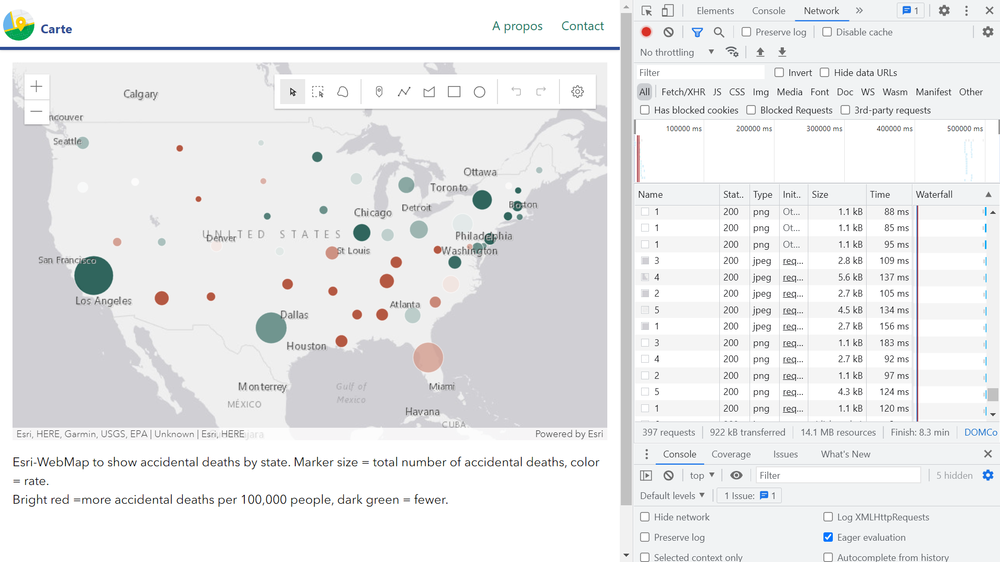
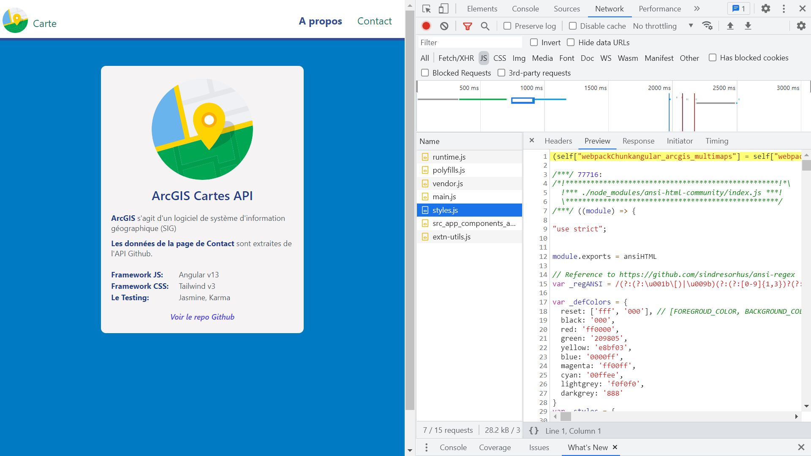
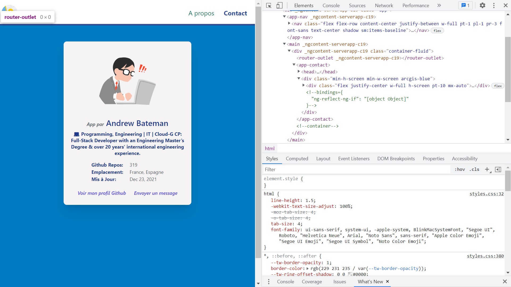
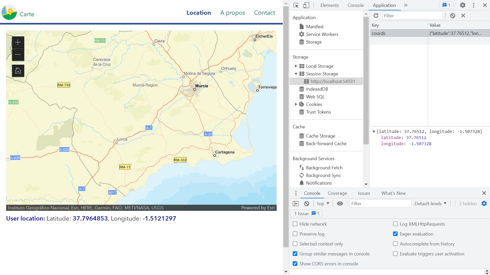

# Angular ArcGIS Multimaps

* Angular multi-page app using RxJS operators and ArcGIS API mapping  from [Esri](https://www.esri.com/en-us/home) to display map
*** Note: to open web links in a new window use: _ctrl+click on link_**

## :page_facing_up: Table of contents

* [Angular ArcGIS Multimaps](#angular-arcgis-multimaps)
  * [:page_facing_up: Table of contents](#page_facing_up-table-of-contents)
  * [:books: General info](#books-general-info)
  * [:camera: Screenshots](#camera-screenshots)
  * [:signal_strength: Technologies](#signal_strength-technologies)
  * [:floppy_disk: Setup](#floppy_disk-setup)
  * [:flashlight: Testing](#flashlight-testing)
  * [:computer: Code Examples](#computer-code-examples)
  * [:cool: Features](#cool-features)
  * [:clipboard: Status & To-Do List](#clipboard-status--to-do-list)
  * [:clap: Inspiration](#clap-inspiration)
  * [:envelope: Contact](#envelope-contact)

## :books: General info

* Basic PWA with SSR and Tailwind CSS
* esri-map view refactored to use @arcgis/core mapView and WebMap with a GraphicsLayer to allow sketching
* WebView map specified using a [portalItem id](https://developers.arcgis.com/javascript/latest/api-reference/esri-WebMap.html#portalItem)
* About page - info. about the app
* Contact page - info. about the author
* Location page uses sessionStorage to store user coordinates and these are lost the moment the browser is closed
* [Progressive Web App (PWA)](https://firt.dev/pwa-2021/) capability added. The PWA is still evolving and I believe worth including in an app but needs to be kept up to date
* [ArcGIS API for Javascript CDN](https://developers.arcgis.com/javascript/latest/guide/get-api/#cdn) link in `esri-map` component.
* [ArcGIS for Developers](https://developers.arcgis.com/) offers a full suite of tools and resources to build mapping and analytics solutions. Use ArcGIS APIs to create location-based applications for web, desktop, and mobile devices.
* [Esri - about](https://www.esri.com/en-us/about/about-esri/overview)
* RxJS subscriptions objects used to represent the execution of observables

## :camera: Screenshots






## :signal_strength: Technologies

* [Angular v14](https://angular.io/)
* [Angular Service Workers v14](https://angular.io/guide/service-worker-getting-started) used to make this a Progressive Web App (PWA)
* [Angular Server-side rendering (SSR) with Angular Universal](https://angular.io/guide/universal)
* [Angular Formcontrol](https://angular.io/api/forms/FormControl)
* [RxJS Library v7](https://angular.io/guide/rx-library) used to handle async operations using observables
* [@arcgis/core v4.23.7](https://www.npmjs.com/package/@arcgis/core) - the version is significant because ES modules were added after v4.18

## :floppy_disk: Setup

* Install dependencies by running `npm i` then enter:
* `npm start` for a dev server. Navigate to `http://localhost:4200/`.
* `npm run build` for a PWA build folder (not working)
* `http-server -p 8080 -c-1 dist/angular-arcgis-multimaps` then select `http://127.0.0.1:8080` to see PWA app running on a dev server (`ng serve` does not work) (not working)
* `npm run build:ssr` to create SSR build files
* `npm run serve:ssr` to see on a dev server `http://localhost:4000`
* The app will automatically reload if you change any of the source files

## :flashlight: Testing

* `ng test` to execute the unit tests via [Karma](https://karma-runner.github.io).
* `ng lint` to lint all files
* `ng e2e` to execute the end-to-end tests via [Protractor](http://www.protractortest.org/).

## :computer: Code Examples

* extract from ``

```typescript

```

## :cool: Features

* Tailwind purges unused CSS to make a very small styles build bundle
* 100% perfect Lighthouse score for About page

## :clipboard: Status & To-Do List

* Status: Working dev
* To-Do: Fix PWA & SSR or replace. Add home page map content, create web address and add to robots.txt and sitemap.xml

## :clap: Inspiration

* [Youtube: ArcGIS API for JavaScript: Building Apps with Angular](https://www.youtube.com/watch?v=ea4D-qGU0_0)
* [Youtube: ArcGIS API for JavaScript: Using Frameworks](https://www.youtube.com/watch?v=pYlnlQD882w&list=PLahIW2YFPQd7V8IJ0sTo9kMtqn-sCqs40&index=2)
* [Esri config example](https://github.com/Esri/application-base-js)
* [ArcGIS API docs](https://developers.arcgis.com/javascript/latest/install-and-set-up/)
* [Matt Callahan Blog: Angular + ArcGIS API for JavaScript: A unit testing strategy using dependency injection and the facade pattern](https://seesharpdotnet.wordpress.com/2020/12/03/angular-and-arcgis-api-for-javascript-a-unit-testing-strategy-using-dependency-injection-and-the-facade-pattern/)
* [ArcGIS Living Atlas of the World](https://livingatlas.arcgis.com/en/browse/#d=2&q=sea%20ice)
* [Dev.to: Setup TailwindCSS in Angular the easy way](https://dev.to/angular/setup-tailwindcss-in-angular-the-easy-way-1i5l)
* [Free svg icons](https://www.iconfinder.com/search/?q=map&price=free)
* [StackOverflow: ngIf - Expression has changed after it was checked](https://stackoverflow.com/questions/43513421/ngif-expression-has-changed-after-it-was-checked)

## :envelope: Contact

* Repo created by [ABateman](https://github.com/AndrewJBateman), email: gomezbateman@yahoo.com
